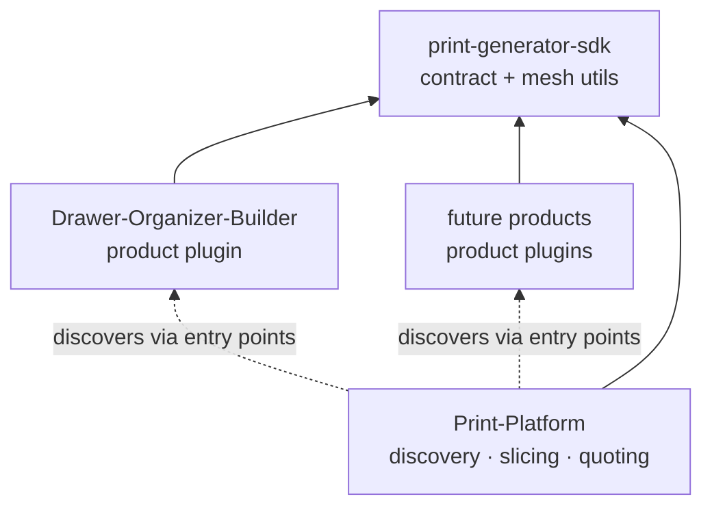
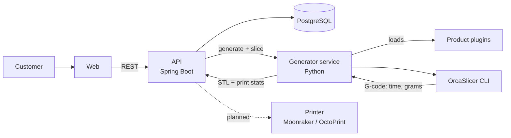

# Print-Platform

> 3D printing platform with parametric part generation and automatic quoting.

Customers pick a configurable product (drawer organizer, bracket, box, label...), enter their dimensions and instantly get a 3D preview and a price. Behind the scenes, the part is generated as an STL, sliced with a real slicer and quoted from the actual print time and filament usage.

Each parametric product lives in **its own repository** as an installable Python package. The platform doesn't contain any product code: it discovers installed products as plugins, slices what they generate and handles quoting and orders.

🚧 **Status:** early development. See the [roadmap](#roadmap).

## Features

- **Pluggable parametric products** — each product is an independent package, discovered automatically at startup
- **Automatic quoting** — price calculated from slicer output (print time + filament weight), not guesswork
- **3D preview** — customers see the part before ordering
- **Order management** — REST API for products, quotes and orders
- **Print queue** *(planned)* — send approved jobs straight to the printer via Moonraker/OctoPrint

## Ecosystem

The project is split into three kinds of repositories:

| Repository | Role |
| --- | --- |
| [print-generator-sdk](https://github.com/guustavomc/print-generator-sdk) | The contract every product implements: `BaseProductGenerator`, `BaseProductParams`, `GenerationResult`, mesh validation and STL/GLB export |
| [Drawer-Organizer-Builder](https://github.com/guustavomc/Drawer-Organizer-Builder) | First product: parametric drawer organizer (+ standalone desktop editor) |
| **Print-Platform** (this repo) | API, product discovery, slicing, quoting, orders and web |



## Architecture



**Quote flow**

1. Customer configures a product on the web page
2. API forwards the product id and parameters to the generator service
3. Generator loads the matching plugin, validates the parameters and builds the STL
4. The STL is checked against the printer's build volume and sliced with the slicer CLI
5. Print time and filament weight are extracted from the G-code
6. API calculates the price: `material + machine time + margin`

**Responsibilities**

- **Products** only know geometry: they validate their own parameters and return a watertight mesh.
- **Generator service** knows the printer: build volume, slicer profiles, print stats.
- **API** knows the business: pricing, margins, orders. Pricing lives exclusively here.

## Product plugins

A product is any installed package that registers a generator under the `print_platform.products` entry point group:

```toml
# pyproject.toml of a product repository
[project]
dependencies = ["print-generator-sdk"]

[project.entry-points."print_platform.products"]
drawer-organizer = "drawer_organizer.generator:DrawerOrganizerGenerator"
```

The generator service discovers them at startup:

```python
from importlib.metadata import entry_points

PRODUCTS = {ep.name: ep.load() for ep in entry_points(group="print_platform.products")}
```

**Adding a new product**

1. Create a new repository following the [Drawer-Organizer-Builder](https://github.com/guustavomc/Drawer-Organizer-Builder) layout
2. Implement a `BaseProductParams` subclass and a `BaseProductGenerator` subclass from the SDK
3. Register it under the `print_platform.products` entry point
4. Add it to `generator/requirements.txt`

No platform code changes are needed.

## Tech stack

| Layer     | Technology                                              |
| --------- | ------------------------------------------------------- |
| API       | Java, Spring Boot, Spring Data JPA                      |
| Generator | Python 3.14, FastAPI, Pydantic                          |
| Products  | Python packages built on print-generator-sdk (trimesh + manifold3d) |
| Slicing   | OrcaSlicer CLI                                          |
| Database  | PostgreSQL                                              |
| Web       | TBD                                                     |
| Infra     | Docker, Docker Compose, GitHub Actions                  |

Parts are modeled with boolean operations on primitives (trimesh with the manifold3d engine), which guarantees watertight, manifold meshes ready for slicing.

## Project structure

```
print-platform/
├── api/                    # Spring Boot: products, orders, quotes
├── generator/              # Python: plugin discovery + slicer integration
│   ├── registry.py         # Discovers product plugins via entry points
│   ├── slicer/             # OrcaSlicer CLI driver, G-code parser, mock slicer
│   ├── api/                # FastAPI routes and schemas
│   ├── profiles/           # Printer / process / filament profiles for the slicer
│   ├── tests/
│   ├── requirements.txt    # Pins the SDK and every product plugin
│   └── main.py
├── web/                    # Customer-facing configurator
├── docs/                   # Architecture, decisions, photos
├── docker-compose.yml
└── .github/workflows/      # CI/CD
```

## Getting started

> Setup instructions will be expanded as the services are implemented.

```bash
git clone https://github.com/guustavomc/print-platform.git
cd print-platform
docker compose up
```

### Generator (local development)

Requires Python 3.14.

```bash
cd generator
python -m pip install -r requirements.txt
python -m pytest -v
```

Use `python -m <tool>` so commands run with the same interpreter the packages were installed into.

### Developing a product and the platform together

Clone the repositories side by side:

```
workspace/
├── print-generator-sdk/
├── Drawer-Organizer-Builder/
└── print-platform/
```

Then install the SDK and products in editable mode inside the platform's environment:

```bash
cd print-platform/generator
python -m pip install -e ../../print-generator-sdk -e ../../Drawer-Organizer-Builder
```

Changes to the SDK or a product show up immediately. Once they're stable, tag a release in that repository and pin the tag in `requirements.txt`:

```
print-generator-sdk @ git+https://github.com/guustavomc/print-generator-sdk@v0.1.0
drawer-organizer    @ git+https://github.com/guustavomc/Drawer-Organizer-Builder@v0.1.0
```

## Roadmap

- [ ] **v0.1 — First product end to end**
  - [ ] Split the ecosystem
    - [x] Generator contract (`BaseProductGenerator`, `GenerationResult`)
    - [x] Mesh validation and STL/GLB export
    - [ ] Extract the contract into `print-generator-sdk` (build volume passed in, not hardcoded)
    - [ ] Move the drawer organizer into Drawer-Organizer-Builder as a plugin
    - [ ] Plugin discovery via entry points
  - [ ] Slicer CLI integration and G-code stats extraction
    - [ ] Printer/process/filament profiles exported from OrcaSlicer
    - [ ] G-code parser (time, grams, meters, layers)
    - [ ] OrcaSlicer CLI driver + mock slicer for local development
  - [ ] Generator HTTP service (`/products`, `/generate/stl`, `/generate/preview`, `/slice`, `/health`)
  - [ ] Quote endpoint in the API
  - [ ] Docker Compose setup
- [ ] **v0.2 — Customer-facing**
  - [ ] Web configurator with 3D preview (parameter forms generated from each product's schema)
  - [ ] Orders and order status
  - [ ] CI pipeline with tests
- [ ] **v0.3 — Production**
  - [ ] Print queue integrated with the printer
  - [ ] More parametric products
  - [ ] Deploy
- [ ] **Later**
  - [ ] Quotes for customer-uploaded STL files
  - [ ] Integration with an Edge AI print failure monitor

## Related projects

- [print-generator-sdk](https://github.com/guustavomc/print-generator-sdk) — the contract shared by every product
- [Drawer-Organizer-Builder](https://github.com/guustavomc/Drawer-Organizer-Builder) — the first product plugin, also usable as a standalone desktop app

## Author

**Gustavo Conceição** · [LinkedIn](https://www.linkedin.com/in/gustavo-m-conceição) · [GitHub](https://github.com/guustavomc)